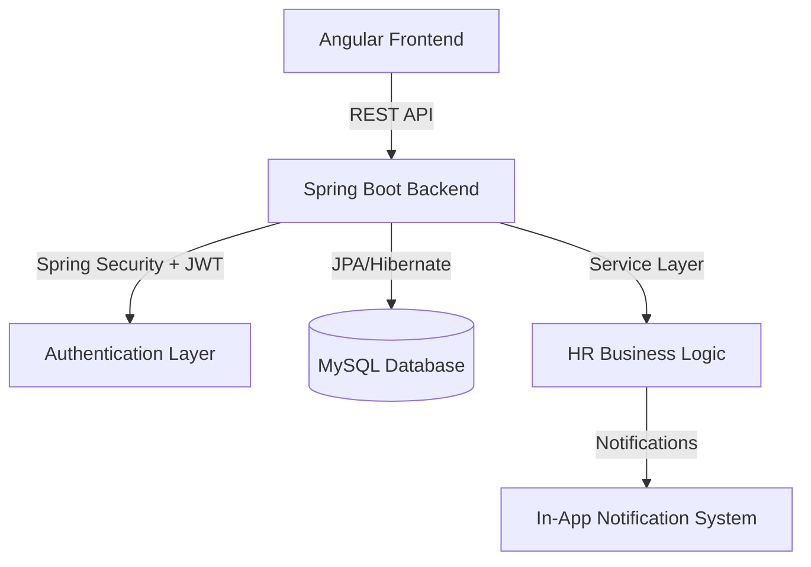

# 🏢 RevWorkforce – Human Resource Management System

**RevWorkforce** is a robust, full-stack monolithic HRM platform designed to streamline the entire employee lifecycle. From seamless leave administration to data-driven performance evaluations, the system provides a centralized hub for organizational management.

---

## 🎨 Application Interface

### 🔐 Secure Login

### 📊 Role-Based Dashboards
| **Admin Dashboard** | **Manager Dashboard** | **Employee Dashboard** |
| :---: | :---: | :---: |
|  |  |  |

---

## 🛠 Tech Stack

    

   

  

---

## 👥 Role-Based Features

### 🛠 Admin (System Controller)
- **Employee Hub**: Full lifecycle management—onboard, update, and manage HR records.
- **Org Management**: Configure departments, job designations, and reporting structures.
- **Leave Analytics**: Manage quotas, adjust balances, and generate department-wide reports.
- **Communication**: Create and post company-wide announcements.
- **Governance**: Access system activity logs and audit trails.

### 👨‍💼 Manager (Team Lead)
- **Team Insights**: View direct reports, their profiles, and hierarchy structures.
- **Workflow Control**: Approve or reject leave requests with mandatory justifications.
- **Performance Coaching**: Review employee performance docs, provide feedback, and assign ratings (1-5 scale).
- **Goal Monitoring**: Keep track of team goals and real-time progress.

### 🧑‍💻 Employee (End User)
- **Personal Portal**: Manage profile details, emergency contacts, and personal info.
- **Leave Self-Service**: View balances, apply for leaves, and track status transitions.
- **Performance Growth**: Submit self-assessments, set yearly goals, and track accomplishments.
- **Stay Connected**: Access the company holiday calendar and receive real-time notifications.

---

## 🏗 System Architecture

The application follows a **monolithic full-stack architecture**, ensuring tight integration between the business logic and the presentation layer.

---

## 🎯 Technical Highlights
- **RBAC (Role-Based Access Control)**: Granular security for Admin, Manager, and Employee levels.
- **Decoupled Frontend**: Angular 18 with reactive state management (RXJS) and responsive design.
- **Secure Authentication**: JWT with Bcrypt password encoding.
- **Automated Workflows**: Full leave lifecycle and performance review automation.

---

## 📝 Future Scope
- 📧 **SMTP Integration**: Email alerts for leave decisions and performance feedback.
- 📊 **Advanced Analytics**: Interactive charts and data visualizations for HR metrics.
- 💰 **Payroll System**: Integrated salary and benefits management.
- 🔗 **Microservices Migration**: Next-gen scalability redesign.

---
