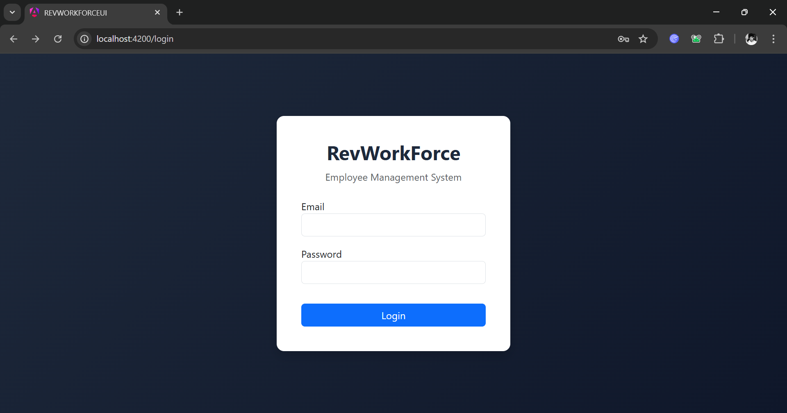
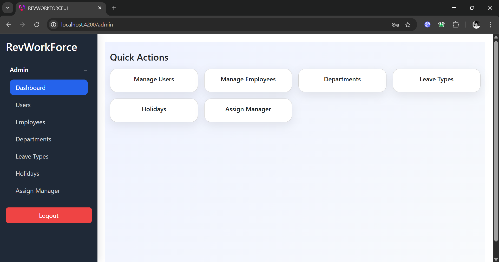
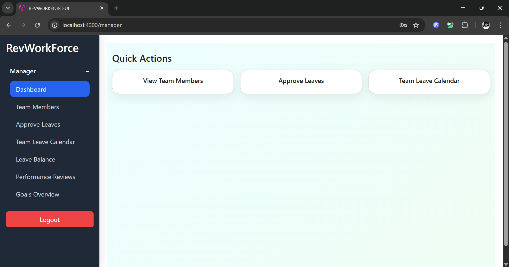
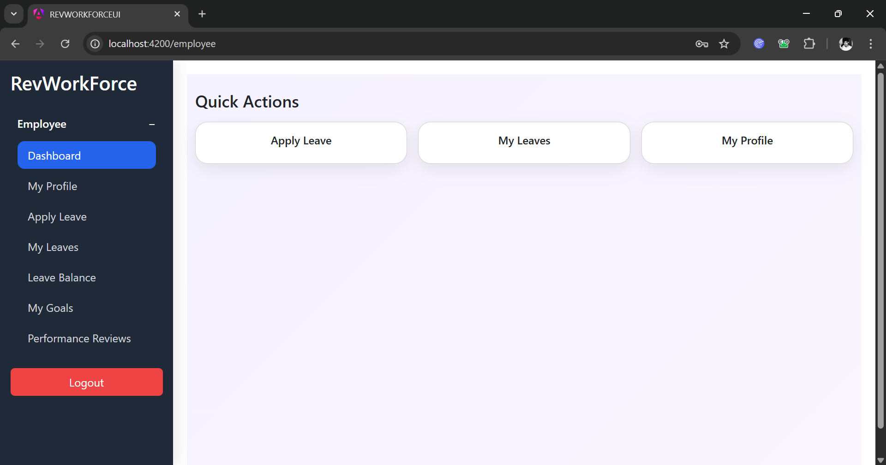

# RevWorkforce – Human Resource Management System
## 📌 **Project Overview**

RevWorkforce is a full-stack monolithic Human Resource Management (HRM) web application built to streamline employee lifecycle management, leave administration, and performance evaluation processes within an organization.

The system supports three hierarchical roles — Employee, Manager, and Admin — with role-based dashboards, secure authentication, automated notifications, and structured data management.

The application is designed with scalability, clean architecture, and real-world HR workflows in mind.

### 🚀 Key Features
### 🔐 **Authentication & Security**

- Role-based login system (Employee / Manager / Admin)

- Secure credential-based authentication

- Controlled access to features based on user roles
----------------------------------------------------
### 👤 **Employee Module Dashboard**

- View leave balance summary

- Track pending leave applications

- Access company announcements

####  Profile Management

- View complete profile details

- Edit personal information (phone, address, emergency contact)

- View reporting manager details

#### Leave Management

- View leave balance (Casual, Sick, Paid Leave)

- Apply for leave with reason and date range

- Track leave status (Pending / Approved / Rejected)

- Cancel pending leave requests

- View company holiday calendar

- Receive real-time in-app notifications on leave decisions

#### Performance Management

- Create and submit performance review documents

Add:

- Key deliverables

- Accomplishments

- Areas of improvement

- Self-assessment rating

- Set yearly goals with deadlines and priorities

- Track goal progress

- View manager feedback and ratings

- Receive notification upon review feedback

#### Employee Directory

- Search employees by name or department

- View company-wide employee information

### 👨‍💼 **Manager Module**

- Managers inherit all Employee features plus:

- Team Leave Management

- View direct reportees

- Approve leave requests with optional comments

- Reject leave requests (mandatory justification)

- View team leave calendar

- Monitor team leave balances

- Get notified when team members apply for leave

#### Performance Review Management

- Review submitted employee performance documents

- Provide structured feedback

- Rate employee performance (1–5 scale)

- Comment on employee goals

- Track goal progress of reportees

- Notification system for review submissions

#### Team Management

- View team hierarchy structure

- Access team member profiles

### 🛠 **Admin Module**
#### Employee Management:

- Add new employees with full HR details

- Update and manage employee records

- Assign/change reporting managers

- Activate/deactivate employee accounts

- Search & filter employees (ID, name, department, designation)

#### Leave Administration:
 
- Configure leave types

- Assign leave quotas

- Manually adjust leave balances with justification

- Manage company holiday calendar

- Generate leave reports (employee-wise / department-wise)

#### **System Configuration:**

- Manage departments

- Manage job designations 

- Create company-wide announcements

- View system activity logs

- Reporting & Analytics

HR dashboard with key metrics:

- Total employees

- Leave statistics

- Employee reports

- Leave utilization reports

### 🏗 **System Architecture:**

RevWorkforce follows a monolithic full-stack architecture, including:

- Frontend (Responsive Web Interface)

- Backend Business Logic Layer

- Database Layer (Relational Schema)

- Role-Based Access Control (RBAC)

- In-App Notification System

#### **Project documentation includes:**

- ERD (Entity Relationship Diagram)

- Application Architecture Diagram

#### Testing Artifacts:

🧠 **Real-World Problem Solved**

Organizations often struggle with:

- Manual leave tracking

- Scattered performance review documentation

- Lack of structured HR reporting

- Poor visibility into employee goal tracking

RevWorkforce centralizes these processes into a unified digital system, improving operational efficiency, accountability, and transparency.

### 🎯**Technical Highlights**

- Role-Based Access Control

- Structured Performance Review Workflow

- Leave Lifecycle Automation

- Goal Tracking System

- Notification-Driven User Experience

- Modular HR Administration

Search & Filtering Optimization

### 📈**Future Enhancements:**

- Email notification integration

- Payroll module integration

- Analytics dashboard with charts

REST API exposure for third-party integrations:

- Microservices refactor for scalability

### 📂**Deliverables**

- Working Web Application

- Source Code Repository

- ERD Documentation

- Architecture Diagram

- Test Artifacts

### **🛠️Tech Stack**

- Backend: Java 17+, Spring Boot(REST API's), Spring Security, JWT Authentication Bcrypt, JPA Hibernate.
- Database: Mysql
- Frontend: Angular(Router, nterceptors Kama RXJS, Responsive UI)
- Build Tools: Maven(Backend), Angular CLI(Frontend), Git(VErsion Control)

### 📌**Standard Functional Scope**

- Authentication & Authorization

- Role-Based Access Control (Employee / Manager / Admin)

- Employee Management System

- Leave Management & Approval Workflow

- Performance Review & Goal Tracking System

- In-App Notification System

- Reporting & HR Analytics Dashboard

## **The Application UI of different pages**
## **Login Page**

## **Admin Dashboard**

## **Manager Dashboard**

## **Employee Dashboard**

